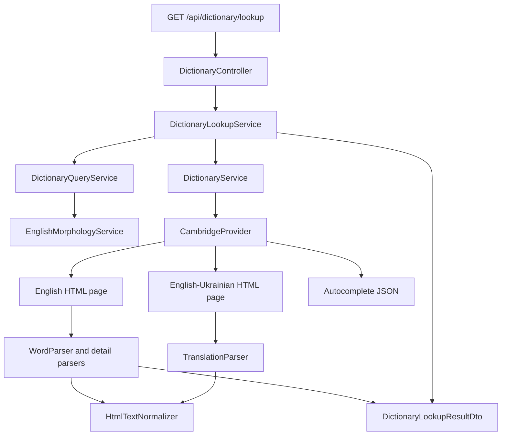

# DictionaryProvider.Api

HTTP API for dictionary lookup, photo translation, and the account data used by LexiFlow.

DictionaryProvider.Api fetches English dictionary pages, parses them into a stable JSON shape, and stores user data in PostgreSQL. LexiFlow calls this API over HTTP. The LexiFlow application is a separate project, and this repository does not contain that client.

Dictionary data comes from Cambridge Dictionary HTML pages plus the Cambridge autocomplete endpoint. Photo translation uses OCR.space for recognition and translates the recognized English text into Ukrainian.

## What the API provides

**Dictionary lookup**

- Headword, provider (`Cambridge`), and origin (`uk`, `us`, or `business`)
- UK and US pronunciation, including IPA and audio URL when the page contains them
- Meanings grouped by part of speech and guide word
- Definitions, CEFR labels, and examples
- Ukrainian translations from the English–Ukrainian Cambridge page
- Synonyms and antonyms, both on the entry and on individual meanings
- Phrasal verbs, idioms, and collocations linked from the page
- Autocomplete suggestions
- A lookup path that normalizes the query, tries a WordNet base form, and resolves multi-word phrases

**Photo translation** (authenticated)

- OCR of a JPG, PNG, or WebP image
- Ukrainian translation of the recognized text
- A word-list mode that translates extracted English words, with a dictionary fallback

**Account data** (authenticated, stored in PostgreSQL)

- Registration and login with a JWT
- Vocabulary lists, sharing, archive, and saved test scores
- Learning-collection snapshots
- In-app notifications
- Feedback reports, with an admin role for reviewing them

There is no separate morphology endpoint. Lemmatization runs inside dictionary search and lookup.

## Getting started

### Prerequisites

- [.NET 9 SDK](https://dotnet.microsoft.com/download/dotnet/9.0) (`net9.0` in `DictionaryProvider.Api.csproj`)
- PostgreSQL. The API uses Npgsql and applies EF Core migrations during startup, so the database must accept connections before the process stays up
- Network access to `dictionary.cambridge.org` for dictionary calls
- An [OCR.space](https://ocr.space/ocrapi) API key if you call photo translation

Cambridge dictionary pages do not use an API key in this project. WordNet lemma files are already in `Data/WordNet` and are copied to the build output.

### Clone and configure secrets

```bash
git clone <repository-url>
cd DictionaryProvider.Api
```

The project id for .NET User Secrets is already set. From the repository root:

```bash
dotnet user-secrets set "ConnectionStrings:DefaultConnection" "Host=localhost;Port=5432;Database=dictionary_provider;Username=YOUR_USER;Password=YOUR_PASSWORD"
dotnet user-secrets set "Jwt:SigningKey" "YOUR_SIGNING_KEY"
dotnet user-secrets set "PhotoTranslation:OcrApiKey" "YOUR_API_KEY"
```

`ConnectionStrings:DefaultConnection` and `Jwt:SigningKey` are required to start. The OCR key is required only when you upload an image. User Secrets are loaded in the Development environment.

Create the PostgreSQL database named in the connection string before the first run. The API creates and updates tables itself.

### Run

```bash
dotnet run
```

That command uses the first launch profile, `http`, and listens on `http://localhost:5019`.

Swagger UI is enabled only when `ASPNETCORE_ENVIRONMENT` is `Development`:

- UI: `http://localhost:5019/swagger`
- OpenAPI document: `http://localhost:5019/swagger/v1/swagger.json`

To bind HTTPS as well:

```bash
dotnet run --launch-profile https
```

That profile listens on `https://localhost:7130` and `http://localhost:5019`. HTTPS redirection is registered only in Development.

A sample request is in `DictionaryProvider.Api.http`:

```http
GET http://localhost:5019/api/dictionary/bad
Accept: application/json
```

### Docker

`Dockerfile` builds the app on `mcr.microsoft.com/dotnet/sdk:9.0` and runs it on `mcr.microsoft.com/dotnet/aspnet:9.0`, port 8080.

```bash
docker build -t dictionaryprovider-api .
docker run --rm -p 8080:8080 \
  -e ConnectionStrings__DefaultConnection="Host=YOUR_HOST;Port=5432;Database=dictionary_provider;Username=YOUR_USER;Password=YOUR_PASSWORD" \
  -e Jwt__SigningKey="YOUR_SIGNING_KEY" \
  dictionaryprovider-api
```

The container listens on `http://+:8080`. Swagger stays off unless you also set `ASPNETCORE_ENVIRONMENT=Development`.

## Configuration

Committed settings live in `appsettings.json` and `appsettings.Development.json`. Those files currently hold the same values. Secrets are not in those files: the JWT signing key and the database connection string must be supplied outside source control.

ASP.NET Core maps environment variables with `__` as the section separator (`Jwt__SigningKey`, `ConnectionStrings__DefaultConnection`). Use that form on a host. Use User Secrets locally.

Startup validation (`ValidateOnStart`) rejects a missing Cambridge setting or a missing JWT issuer, audience, or signing key. Photo translation, admin, and feedback settings are bound without that check.

### Connection string

| Key | Required | Purpose |
|---|---|---|
| `ConnectionStrings:DefaultConnection` | Yes, at startup | Npgsql connection string. `Program.cs` calls `Database.Migrate()` before `app.Run()` |

Example:

```text
Host=localhost;Port=5432;Database=dictionary_provider;Username=YOUR_USER;Password=YOUR_PASSWORD
```

### Jwt

| Key | Required | Default in appsettings | Purpose |
|---|---|---|---|
| `Jwt:Issuer` | Yes | `LexiFlow.Api` | Token issuer |
| `Jwt:Audience` | Yes | `LexiFlow.Client` | Token audience |
| `Jwt:SigningKey` | Yes | not committed | HMAC-SHA256 key. Use a long random value |
| `Jwt:AccessTokenMinutes` | Yes, greater than 0 | `1500` | Lifetime when `rememberMe` is false |
| `Jwt:RememberMeDays` | Yes, greater than 0 | `14` | Lifetime when `rememberMe` is true, converted to minutes as `days * 24 * 60` |

Registration always issues a remember-me token. Login uses the `rememberMe` flag from the request.

```bash
dotnet user-secrets set "Jwt:SigningKey" "YOUR_SIGNING_KEY"
```

### Cambridge

`CambridgeProvider` reads dictionary HTML. It does not call an official Cambridge API.

| Key | Required | Value in appsettings | Purpose |
|---|---|---|---|
| `Cambridge:BaseUrl` | Yes | `https://dictionary.cambridge.org/dictionary/english/` | English entry pages. The word slug is appended |
| `Cambridge:TranslationBaseUrl` | Yes | `https://dictionary.cambridge.org/dictionary/english-ukrainian/` | Ukrainian translation pages |
| `Cambridge:AutocompleteUrl` | Yes | `https://dictionary.cambridge.org/autocomplete/amp` | Suggestion JSON |
| `Cambridge:AutocompleteDataset` | Yes | `english` | `dataset` query parameter |
| `Cambridge:UserAgent` | Yes | `DictionaryProvider.Api/1.0 (+https://dictionary.cambridge.org; educational parser)` | `User-Agent` on the Cambridge `HttpClient` |
| `Cambridge:TimeoutSeconds` | Yes, greater than 0 | `10` | Cambridge `HttpClient` timeout |
| `Cambridge:DictionaryVariant` | Yes | `uk` | Which dictionary block to parse. `uk` selects `data-id="cald4"`, `us` selects `cacd`, `be` or `business` selects `cbed` |
| `Cambridge:TranslationLanguage` | Yes | `uk` | `lang` filter on translation spans, and the value stored on those translations |
| `Cambridge:SiteUrl` | Used when resolving media links | `https://dictionary.cambridge.org` | Base URI in `HtmlTextNormalizer`. Startup does not validate this key |

`DictionaryVariant` also becomes `origin` on the response: `us` stays `us`, `be` and `business` become `business`, and every other value becomes `uk`.

### PhotoTranslation

| Key | Required to upload an image | Value in appsettings | Purpose |
|---|---|---|---|
| `PhotoTranslation:OcrEndpoint` | Yes for OCR | `https://api.ocr.space/parse/image` | OCR.space parse endpoint |
| `PhotoTranslation:OcrApiKey` | Yes for OCR | empty | Sent as the `apikey` form field |
| `PhotoTranslation:TranslationEndpoint` | Used as the second translator | `https://api.mymemory.translated.net/get` | MyMemory `en\|uk` request |
| `PhotoTranslation:TranslationEmail` | No | set in appsettings | Optional MyMemory `de` contact parameter. Override it; do not commit a personal address if you change it |
| `PhotoTranslation:TranslationFallbackEndpoint` | Used first | `https://translate.googleapis.com/translate_a/single` | Called before MyMemory. The name in configuration is historical: this endpoint is tried first |
| `PhotoTranslation:MaxImageBytes` | Checked by the controller | `10485760` | Rejects larger uploads. The action also has a 10 MB request-size limit |

```bash
dotnet user-secrets set "PhotoTranslation:OcrApiKey" "YOUR_API_KEY"
```

The photo-translation `HttpClient` timeout is 90 seconds and is not configurable.

### Admin

| Key | Required | Purpose |
|---|---|---|
| `Admin:DeveloperEmails` | No | Emails that receive the `Admin` role at login and registration. Comparison is case-insensitive. An empty list means nobody is an admin |

The role is written into the JWT. Changing this list does not change tokens that are already issued.

### FeedbackNotification

Email is off unless `Enabled` is true. A missing SMTP host is logged and the feedback request still succeeds. A send failure is logged and does not change the HTTP response.

| Key | Purpose |
|---|---|
| `FeedbackNotification:Enabled` | `false` in appsettings. Mail is skipped while this is false |
| `FeedbackNotification:NotifyEmail` | Recipient. Mail is skipped when this is empty |
| `FeedbackNotification:SmtpHost` | SMTP host. Required in practice once notifications are enabled |
| `FeedbackNotification:SmtpPort` | `587` in appsettings |
| `FeedbackNotification:SmtpUsername` | Optional SMTP username |
| `FeedbackNotification:SmtpPassword` | Optional SMTP password. Set this with User Secrets or an environment variable |
| `FeedbackNotification:SmtpFrom` | From address. Falls back to `SmtpUsername`, then `noreply@lexiflow.local` |
| `FeedbackNotification:UseSsl` | `true` in appsettings. Passed to `SmtpClient.EnableSsl` |

```bash
dotnet user-secrets set "FeedbackNotification:SmtpPassword" "YOUR_SECRET"
```

### CORS

CORS is not configuration. The `LexiFlowClient` policy in `Program.cs` allows:

- `https://localhost:7102`
- `http://localhost:5087`
- `https://localhost:7260`
- `http://localhost:5231`
- `https://lexi-flow-plum.vercel.app`

Any header and any method are allowed on those origins. Other browser origins are rejected. Server-side HTTP clients are unaffected.

## API endpoints

Routes are case-insensitive. Authenticated routes expect `Authorization: Bearer <accessToken>`.

Dictionary routes are anonymous. `GET /api/dictionary/lookup` is the call to use for a search box: it normalizes the query and can resolve a phrase. `GET /api/dictionary/{word}` fetches one Cambridge page and returns 404 when that page does not yield an entry.

| Method | Endpoint | Auth | Description |
|---|---|---|---|
| GET | `/api/dictionary/search?query=` | No | Autocomplete. `term` is accepted when `query` is empty. Fewer than 2 characters returns `[]` |
| GET | `/api/dictionary/lookup?query=` | No | Normalized lookup. Returns 200 with `isFound` |
| POST | `/api/dictionary/suggestion` | No | Loads the Cambridge URL stored on a suggestion |
| GET | `/api/dictionary/{word}` | No | Direct page fetch. `{word}` is one path segment; encode spaces |

| Method | Endpoint | Auth | Description |
|---|---|---|---|
| POST | `/api/auth/register` | No | Creates a user and returns a token |
| POST | `/api/auth/login` | No | Checks email and password and returns a token |
| POST | `/api/auth/logout` | Yes | Returns 204. The token is not revoked server-side |
| GET | `/api/auth/me` | Yes | Current user |
| POST | `/api/photo-translate` | Yes | Multipart image OCR and translation |
| POST | `/api/photo-translate/text` | Yes | Translates text that was already recognized |
| GET | `/api/lists?archived=` | Yes | Lists owned by the caller. `archived=false` (the default when the query is omitted) returns active lists. `archived=true` returns archived lists |
| GET | `/api/lists/{id}` | Yes | One list the caller owns or that was shared with them, including words and shares |
| POST | `/api/lists` | Yes | Creates a list. Body: `name`, optional `description` |
| PUT | `/api/lists/{id}` | Yes | Updates name and description. Owner only |
| DELETE | `/api/lists/{id}` | Yes | Deletes an owned list |
| POST | `/api/lists/{id}/archive` | Yes | Archives an owned list |
| POST | `/api/lists/{id}/restore` | Yes | Restores an owned list |
| POST | `/api/lists/{id}/words` | Yes | Adds a word. Body: `word`, optional `dictionaryWordId` |
| DELETE | `/api/lists/{id}/words/{wordId}` | Yes | Removes a word from an owned list |
| POST | `/api/lists/{id}/share` | Yes | Shares an active list with `userId` or `email`. `permission` defaults to `Reader`. `Reader`, `Editor`, and `Owner` are accepted; any other string is stored as `Reader` |
| DELETE | `/api/lists/{id}/share/{userId}` | Yes | Removes a share. Owner only |
| POST | `/api/lists/{id}/test-results` | Yes | Saves a score for an owner or someone the list was shared with |
| GET | `/api/shared-lists` | Yes | Lists shared with the caller |
| GET | `/api/learning-collections` | Yes | Snapshot for the caller. `initialized` is false until the first save |
| PUT | `/api/learning-collections` | Yes | Replaces the caller's collections with the body |
| DELETE | `/api/learning-collections/{id}` | Yes | Deletes one collection |
| GET | `/api/notifications` | Yes | Newest 100 notifications for the caller |
| POST | `/api/notifications/{id}/read` | Yes | Marks one notification read |
| POST | `/api/feedback` | No | Stores a feedback report. A valid bearer token is optional; when it is present, the user id is stored on the report |
| GET | `/api/feedback/admin` | Admin | Lists reports |
| GET | `/api/feedback/admin/{id}` | Admin | One report |
| PATCH | `/api/feedback/admin/{id}/status` | Admin | Sets `New`, `InProgress`, or `Resolved` |

There is no health-check endpoint.

### Authentication bodies

Register:

```json
{
  "userName": "ada",
  "email": "ada@example.com",
  "password": "at-least-8",
  "confirmPassword": "at-least-8"
}
```

`userName` max length is 80. `email` max length is 320. `password` minimum length is 8 and must match `confirmPassword`.

Login:

```json
{
  "email": "ada@example.com",
  "password": "at-least-8",
  "rememberMe": true
}
```

A successful register or login returns:

```json
{
  "accessToken": "<jwt>",
  "expiresAt": "2026-10-10T12:00:00+00:00",
  "user": {
    "id": "00000000-0000-0000-0000-000000000000",
    "email": "ada@example.com",
    "userName": "ada",
    "createdAt": "2026-09-26T12:00:00+00:00",
    "isAdmin": false
  }
}
```

Duplicate email and bad credentials return a validation problem on the `Email` field.

### Feedback body

`type` must be one of `Bug`, `Incorrect translation`, `Incorrect dictionary data`, `Feature request`, or `Other`. `description` must be 10 to 4000 characters. `pageOrFeature`, `contactEmail`, and `diagnostics` are optional and are truncated.

```json
{
  "type": "Incorrect dictionary data",
  "description": "The example sentence for this entry is incomplete.",
  "pageOrFeature": "dictionary lookup",
  "contactEmail": "ada@example.com",
  "diagnostics": null
}
```

The response is `{ "id": "<guid>", "received": true }`.

### Learning collections

`PUT /api/learning-collections` deletes the caller's stored collections and inserts the request. Send the full snapshot. Each collection needs an id and a name. At most one collection may have `isDefault: true`. Collection ids, collection names, and word ids must be unique. Each word needs an id and a non-empty `word`.

A user who has never saved receives `{ "initialized": false, "collections": [] }`.

## Response format

JSON uses camelCase.

`GET /api/dictionary/{word}` and `POST /api/dictionary/suggestion` return a `DictionaryWordDto`. `GET /api/dictionary/lookup` wraps that entry.

Lookup shape:

```json
{
  "query": "break the ice",
  "resolvedQuery": "break the ice",
  "isFound": true,
  "suggestions": [],
  "entry": {
    "word": "break the ice",
    "provider": "Cambridge",
    "origin": "uk",
    "pronunciations": [
      {
        "dialect": "uk",
        "ipa": "example IPA",
        "audioUrl": "https://dictionary.cambridge.org/media/english/uk_pron/example.mp3"
      },
      {
        "dialect": "us",
        "ipa": "example IPA",
        "audioUrl": null
      }
    ],
    "meanings": [
      {
        "partOfSpeech": "idiom",
        "guideWordGroups": [
          {
            "guideWord": null,
            "meanings": [
              {
                "definition": "to make people who have not met before feel more relaxed",
                "cefrLevel": "C2",
                "examples": [
                  { "text": "We played a game to break the ice." }
                ],
                "translations": [],
                "synonyms": [],
                "antonyms": []
              }
            ]
          }
        ]
      }
    ],
    "translations": [
      { "language": "uk", "text": "приклад перекладу" }
    ],
    "synonyms": [
      { "text": "related term", "url": "https://dictionary.cambridge.org/dictionary/english/example" }
    ],
    "antonyms": [],
    "phrasalVerbs": [],
    "idioms": [],
    "collocations": [
      { "text": "break the ice", "examples": [] }
    ]
  }
}
```

The strings above illustrate the fields. A live response depends on the Cambridge page.

| Field | Meaning |
|---|---|
| `query` | Lookup query after punctuation and extra whitespace are removed |
| `resolvedQuery` | Candidate that produced this result. It can be the WordNet base form |
| `isFound` | True when an entry was returned or when a multi-word query produced suggestion matches |
| `suggestions` | Autocomplete matches kept when a phrase page could not be loaded. Empty when `entry` is set |
| `entry` | Parsed entry, or `null` |
| `entry.provider` | Always `Cambridge` in the current parser |
| `entry.origin` | Dictionary variant: `uk`, `us`, or `business` |
| `entry.translations` | Ukrainian lines from the English–Ukrainian page |
| `meanings[].translations` | Translation spans found inside an English definition block. Often empty, because Ukrainian text is loaded separately onto `entry.translations` |

`isFound: true` with `entry: null` means the phrase matched autocomplete items, and fetching those items did not produce an entry. Read `suggestions` in that case.

Collections are empty arrays when the parser finds nothing. They are not null.

These string fields are null when the page has no matching node:

- `pronunciations[].ipa`
- `pronunciations[].audioUrl`
- `meanings[].partOfSpeech`
- `guideWord`
- `definition`
- `cefrLevel`
- `synonyms[].url`, `antonyms[].url`, `phrasalVerbs[].url`, `idioms[].url`

`translations[].language` is the span's `lang` attribute. On the translation page the parser asks for `uk`. It can be an empty string when a span has no `lang`.

`collocations[].examples` is always an empty array. `CollocationParser` stores the collocation text and does not read examples.

A pronunciation object is omitted when both IPA and audio are missing. UK and US are both read from the page, including when `origin` is `uk`. The first pronunciation found for each dialect is kept.

Search returns an array of at most 12 items:

```json
[
  { "word": "break the ice", "url": "/dictionary/english/break-the-ice" }
]
```

`url` is whatever the autocomplete payload contained. It may be relative.

Suggestion request:

```json
{
  "word": "break the ice",
  "url": "/dictionary/english/break-the-ice"
}
```

Both `word` and `url` are required.

## How dictionary lookup works

Two public paths share `CambridgeProvider`.

`GET /api/dictionary/{word}` trims the path value and loads that Cambridge page. It does not lemmatize and it does not call autocomplete.

`GET /api/dictionary/lookup` is the path that decides which string to load.



1. `DictionaryController.LookupAsync` returns 400 when `query` is missing or whitespace.
2. `DictionaryQueryService.Normalize` replaces `!?.,;:"“”` and hyphen characters with spaces, then collapses whitespace.
3. `GetCandidates` asks `EnglishMorphologyService` for a base form of each word and uses the first form it returns. Lookup tries the base phrase first, then the original phrase. If they are equal, only one candidate is tried.
4. For each candidate, `DictionaryService.GetWordAsync` calls `CambridgeProvider.GetWordAsync`.
5. The provider builds `{BaseUrl}{slug}`. The slug is the lowercased candidate, words joined with `-`, then URL-encoded. `running shoes` becomes a request for `.../english/running-shoes`.
6. The named `HttpClient` `Cambridge` sends the GET with the configured user agent and timeout.
7. HTTP 404, or a redirect that lands on the dictionary root, becomes "no entry". Any other non-success status throws.
8. `WordParser` parses the HTML. A null parse also becomes "no entry".
9. The provider then GETs `{TranslationBaseUrl}{slug}`. A missing translation page leaves `translations` empty. A non-success status other than 404 fails the whole lookup.
10. If the parsed `word` matches the candidate after the same normalization, lookup returns that entry and stops.
11. A single-word candidate that did not match exactly is discarded. Lookup does not fall back to autocomplete for one word.
12. A multi-word candidate that did not match exactly calls search. Suggestions are kept when the suggestion text equals the phrase, or starts with the phrase plus a space, after text in parentheses is removed. Each remaining suggestion is loaded with `GetSuggestionAsync` until one parses.
13. If a candidate produces an entry or any leftover phrase suggestions, lookup returns 200 and `isFound: true`. Otherwise it returns the first candidate, `entry: null`, `suggestions: []`, and `isFound: false`.

`GET /api/dictionary/search` uses the same autocomplete call, but it tries the original query before the base form and returns the first non-empty list. Results are deduplicated by word and capped at 12.

`POST /api/dictionary/suggestion` GETs the suggestion URL. An absolute URL is used as-is. A relative URL is resolved against `https://dictionary.cambridge.org`. That host is fixed in `BuildSuggestionUri` and does not read `Cambridge:SiteUrl`.

Morphology data is loaded on the first dictionary request that constructs `EnglishMorphologyService`. Missing WordNet files throw `FileNotFoundException`. Loaded files are `noun.exc`, `verb.exc`, `adj.exc`, `adv.exc`, `index.noun`, `index.verb`, and `index.adj`. Exception lines are trusted as base forms. Suffix rules for nouns, verbs, and adjectives are accepted only when the candidate exists in the matching index. `GetBaseForms` drops a form that is identical to the input word.

## Word parsing

`WordParser.Parse` loads the HTML with HtmlAgilityPack and selects one dictionary block:

| `DictionaryVariant` | `data-id` | `origin` |
|---|---|---|
| `us` | `cacd` | `us` |
| `be` or `business` | `cbed` | `business` |
| anything else, including `uk` | `cald4` | `uk` |

When the requested word is present, the parser looks for a `.headword` whose text matches it. If that node sits inside `.idiom-block` or `.pv-block`, only that block is parsed. A normal headword has neither ancestor, so parsing continues with the whole dictionary block.

The page headword is the `.hw.dhw` span. If that text is empty, the parse returns null and the API treats the word as missing.

```text
Cambridge HTML
        │
        ▼
   WordParser
        │
        ├── PronunciationParser     IPA and audio, uk then us
        ├── MeaningParser           part of speech, guide words, definitions
        │     ├── ExampleParser
        │     ├── TranslationParser
        │     ├── SynonymParser
        │     └── AntonymParser
        ├── SynonymParser           entry-level synonyms
        ├── AntonymParser           entry-level antonyms
        ├── PhrasalVerbParser       links in the phrasal-verb cross-reference
        ├── IdiomParser             links in the idiom cross-reference
        └── CollocationParser       collocation text
                    │
                    ▼
            DictionaryWordDto
                    │
                    ▼
         TranslationParser on the English–Ukrainian page
```

`CambridgeProvider` attaches the Ukrainian list after `WordParser` returns. The same parser instances are used for a normal entry and for an idiom or phrasal-verb block. What changes is the HTML node they receive.

| Parser | What it adds |
|---|---|
| `PronunciationParser` | One `uk` and one `us` pronunciation from `.dpron-i`, with `.ipa` and `source[type=audio/mpeg]` |
| `MeaningParser` | One `DictionaryEntryDto` per `.entry-body__el`. Senses are `.dsense`, or `.dsense-noh` when that class is absent. A sense without definitions is dropped |
| `ExampleParser` | `.eg` / `.deg` text inside the definition. If none exist, `.eg.dexamp` items on the parent sense |
| `TranslationParser` | `.trans.dtrans` text. On a definition it keeps every language. On the translation page it keeps `lang` equal to `TranslationLanguage` |
| `SynonymParser` | Links that follow a node containing "synonym" |
| `AntonymParser` | Links that follow a node containing "opposite" or "antonym" |
| `PhrasalVerbParser` | Links inside the phrasal-verb cross-reference block |
| `IdiomParser` | Links inside the idiom cross-reference block |
| `CollocationParser` | Text of `.collocation` or `.dcoll` nodes |

Each related-term parser drops empty text and duplicate text. Meaning-level synonyms and antonyms are parsed from the definition node. Entry-level lists are parsed from the dictionary block, or from the idiom/phrasal-verb block when that block was selected.

## Phrase parsing

There is no separate phrase parser. A phrase is a query that still contains a space after normalization.

`GET /api/dictionary/lookup?query=break%20the%20ice` is the endpoint that handles that. `GET /api/dictionary/break%20the%20ice` only builds the hyphenated slug and parses that page. It will not search autocomplete when the headword differs.

Lookup treats a phrase like this:

1. Normalize, then lemmatize each word. `broke the ice` can be tried as `break the ice` first, because lookup prefers base forms.
2. Request the hyphenated English page and parse it with the phrase as `expectedWord`.
3. If Cambridge rendered the phrase as a `.headword` inside `.idiom-block` or `.pv-block`, `WordParser` parses that block and sets `word` to the requested phrase. Pronunciation, meanings, examples, related terms, and collocations come from that block only. Cross-references that live outside the block are not included.
4. If the phrase is not inside one of those blocks, the parser falls back to the page headword. Lookup keeps the entry only when that headword matches the candidate.
5. When the page is not an exact match, lookup calls autocomplete and then fetches suggestion URLs. Parentheses are stripped only for this comparison, so a suggestion such as `break the ice (idiom)` can match `break the ice`.
6. The first suggestion that parses is returned as `entry`. Its `word` is the block phrase when a block matched, otherwise the page headword.

The same sections exist on a phrase entry as on a word entry. Sections that are not in the selected block come back as empty arrays. Nothing in the DTO marks an entry as a phrase; callers see the usual `DictionaryWordDto` and can tell a phrase from `word` containing spaces.

A phrase that matches neither a page nor autocomplete returns `isFound: false`.

## Parsing and normalization

`HtmlTextNormalizer` is the only place that cleans text and expands Cambridge URLs. Parsers call it instead of trimming strings themselves.

`Clean` returns null for null or whitespace. Otherwise it HTML-decodes the value and collapses every whitespace run to a single space. `Text` runs `Clean` on a node's `InnerText`.

`AbsoluteCambridgeUrl` returns null for a blank value. An absolute `http` or `https` URL is kept. Any other value is resolved against `Cambridge:SiteUrl`.

With the configured site URL, a media path such as `/media/english/uk_pron/...mp3` becomes `https://dictionary.cambridge.org/media/english/uk_pron/...mp3`. The same helper is used for synonym, antonym, phrasal-verb, and idiom links.

Keeping this in one class means a Cambridge host change is a configuration change for parsed links, and parsers stay focused on which nodes to read. Suggestion URLs are the exception: relative suggestion links are resolved in `CambridgeProvider` against a hard-coded Cambridge origin, not `SiteUrl`.

## External provider integration

The dictionary provider is `CambridgeProvider`, registered as `ICambridgeProvider`. One named `HttpClient`, `Cambridge`, is used for entry pages, translation pages, and autocomplete.

What is requested:

| Call | URL |
|---|---|
| English entry | `{BaseUrl}` + hyphenated slug |
| Ukrainian translations | `{TranslationBaseUrl}` + hyphenated slug |
| Suggestions | `{AutocompleteUrl}?dataset={AutocompleteDataset}&q={query}` with `Accept: application/json` |
| A chosen suggestion | The suggestion `url`, made absolute when needed |

The entry and translation responses are HTML. Autocomplete is JSON deserialized into `CambridgeAutocompleteItem` (`word`, `url`, `beta`). `beta` is not returned to clients.

Handling:

- 404 on an entry or suggestion becomes null
- 404 on autocomplete becomes an empty list
- 404 on the translation page becomes an empty `translations` list
- A final URL equal to the dictionary or translation base URL is treated as a miss. Cambridge uses that redirect for unknown headwords
- Any other failed status becomes `HttpRequestException` from `EnsureSuccessStatusCode`
- HTML that has no selected dictionary block, or no headword, becomes null

Clients receive `DictionaryWordDto` and the related records. They do not receive Cambridge HTML. The parser still depends on Cambridge class names (`hw`, `dhw`, `dsense`, `ddef_block`, `ipa`, and the rest). A markup change on the site shows up as empty fields or a not-found result.

## Photo translation

Photo translation is part of this API. Both routes require a JWT.

```text
JPG, PNG, or WebP
        │
        ▼
POST /api/photo-translate
        │
        ▼
size and content-type checks
        │
        ▼
OCR.space  (language=eng, OCREngine=2, scale=true)
        │
        ▼
recognized text
        │
        ├── mode Text      paragraphs, then chunks of about 1500 characters
        └── mode WordList  English tokens, batched by about 400 characters
                │
                ▼
        translate.googleapis.com   (sl=en, tl=uk)
                │  on failure
                ▼
        api.mymemory.translated.net   (langpair=en|uk)
                │
                ▼
        keep the text only when it contains Ukrainian letters
                │
                ▼
        WordList may still call dictionary lookup per word
                │
                ▼
        PhotoTranslationDto
```

`POST /api/photo-translate` is `multipart/form-data` with a file field named `image` and an optional `mode`. `mode` defaults to `Text`. The other value is `WordList`. Accepted content types are `image/jpeg`, `image/png`, and `image/webp`. An empty file, a file larger than `MaxImageBytes`, or another content type returns 400 with `ProblemDetails`.

`POST /api/photo-translate/text` accepts JSON:

```json
{
  "text": "recognized English text",
  "mode": 0
}
```

`PhotoTranslationMode` is serialized as a number by the default JSON options: `0` is `Text`, `1` is `WordList`. The form endpoint accepts the enum names `Text` and `WordList`.

Text mode splits on blank lines, flattens each paragraph to one line, then packs sentences into chunks of 1500 characters. The chunks of one paragraph are translated in parallel and joined with spaces. Paragraphs stay separated by a blank line. Word-list mode extracts tokens that look like English words, including internal apostrophes and hyphens, and keeps the first occurrence of each token ignoring case.

Translation tries the Google endpoint first and MyMemory second. A result is accepted when it is non-empty, differs from the source, is not a MyMemory quota warning, and contains a Ukrainian letter. Text mode rejects the whole translation when that check fails. Word-list mode then calls `DictionaryService.GetWordAsync` and uses the first Ukrainian dictionary translation. A word that still fails gets `error` set to `Ukrainian translation unavailable.`

Success body:

```json
{
  "originalText": "hello",
  "translatedText": "привіт",
  "words": [],
  "translationError": null
}
```

Word-list mode leaves `translatedText` empty and fills `words`:

```json
{
  "originalText": "hello world",
  "translatedText": "",
  "words": [
    { "word": "hello", "translation": "привіт", "error": null },
    { "word": "world", "translation": null, "error": "Ukrainian translation unavailable." }
  ],
  "translationError": null
}
```

OCR that returns no text yields 200 with empty `originalText` and `translatedText`. When translation fails after OCR, the service still returns 200, keeps `originalText`, and sets `translationError`. Quota failures use the message `Translation quota was exceeded. Recognized text was kept — you can retry translation.` Other translation failures use `Translation failed after text recognition. Recognized text was kept — you can retry translation.`

OCR HTTP errors and OCR processing errors throw before that recovery path and become HTTP 502.

## Error handling

The API does not use one error envelope. `[ApiController]` turns invalid models into validation problems. Several actions return `ProblemDetails`. A few list and learning actions return `{ "message": "..." }`.

| Situation | Result |
|---|---|
| Lookup query missing or whitespace | 400, empty body |
| Lookup finds nothing | 200, `isFound: false`, `entry: null` |
| Direct word or suggestion not found, including Cambridge 404 and a null parse | 404 |
| Search shorter than 2 characters | 200, `[]` |
| Suggestion body missing `word` or `url` | 400 |
| Cambridge status other than 404, or a translation-page failure | `HttpRequestException`. Search and `GET /api/dictionary/{word}` catch it and return 500 `ProblemDetails`. Lookup and suggestion do not catch it |
| Parse exception | Same split: search and direct word return 500; lookup and suggestion do not |
| 500 detail text | In Development, `exception.Message`. Otherwise `Dictionary search failed.` or `Dictionary parsing failed.` |
| Missing Cambridge or JWT settings | Process exits during startup validation |
| Missing or unreachable PostgreSQL | Process exits when migrations run |
| Missing WordNet file | 500 on the first request that constructs the morphology service |
| Register or login validation failure | 400 validation problem |
| Missing or bad JWT on an authorized route | 401 |
| Feedback admin without the `Admin` role | 403 |
| Logout | 204. The JWT remains valid until it expires |
| Unknown list, share, notification, or feedback report | 404 |
| Duplicate word in a list | 409 `{ "message": "This word already exists in the list." }` |
| Invalid list test score | 400 `{ "message": "The test score is invalid." }` |
| List name missing | 400 validation problem |
| Learning-collection validation | 400 `{ "message": "<reason>" }` |
| Database failure while saving a list or learning collections | 500 problem |
| Photo image empty, too large, or wrong type | 400 `ProblemDetails` |
| Photo text body empty | 400 `ProblemDetails` |
| OCR failure | 502 `ProblemDetails`, title `Photo translation failed` |
| Translation failure after text exists | 200 with `translationError` set |
| Feedback type or description invalid | 400 `ProblemDetails` |
| Feedback status other than `New`, `InProgress`, `Resolved` | 400 `ProblemDetails` |
| SMTP failure after feedback is stored | 200. The mail error is logged |

Malformed Cambridge HTML usually becomes null fields or a null entry. HtmlAgilityPack still builds a document from broken markup. An unexpected exception in a parser is not converted into an empty entry.

## Architecture

```text
Controllers
    │
    ├── DictionaryController
    │       ├── DictionaryLookupService
    │       │       ├── DictionaryQueryService
    │       │       │       └── EnglishMorphologyService  (WordNet files)
    │       │       └── DictionaryService
    │       └── DictionaryService
    │               └── CambridgeProvider
    │                       ├── HttpClient "Cambridge"
    │                       ├── WordParser
    │                       │       └── detail parsers
    │                       │               └── HtmlTextNormalizer
    │                       └── TranslationParser
    │
    ├── PhotoTranslateController
    │       └── PhotoTranslationService
    │               ├── HttpClient "PhotoTranslation"  (OCR.space, Google, MyMemory)
    │               └── DictionaryService             (word-list fallback)
    │
    └── Auth, lists, learning collections, notifications, feedback
            └── ApplicationDbContext  (PostgreSQL, migrate on startup)
```

Dictionary parsing is stateless. Parsed entries are not written to `dictionary_words`. That table is only a lookup target when a vocabulary-list word is added: if a row already exists for the id or normalized word, the list item stores its id. The current code never inserts into `dictionary_words`.

Services are registered explicitly in `Program.cs`. Parsers are scoped. `DictionaryQueryService` and `EnglishMorphologyService` are singletons. Morphology data is loaded once.

Account passwords are hashed with ASP.NET Core `PasswordHasher`. Authorization policy `Developer` requires role `Admin`.

## Project structure

```text
DictionaryProvider.Api/
├── Configuration/          Options classes bound from configuration
├── Controllers/            HTTP endpoints
├── Data/
│   ├── ApplicationDbContext.cs
│   ├── Migrations/         Applied automatically on startup
│   └── WordNet/            Lemma indexes and exception lists
├── Dtos/                   Request and response models
│   ├── Authentication/
│   ├── Dictionary/
│   ├── Feedback/
│   ├── Learning/
│   ├── Notifications/
│   └── PhotoTranslation/
├── Entities/               EF Core entities
├── Enums/
├── Parsers/
│   ├── HtmlTextNormalizer.cs
│   ├── Cambridge/          WordParser, MeaningParser, TranslationParser
│   └── Details/            Pronunciation, examples, related terms, collocations
├── Services/
│   ├── Authentication/
│   ├── Dictionary/         Facade over CambridgeProvider
│   ├── DictionaryLookup/   Query candidates and phrase fallback
│   ├── DictionaryQuery/    Normalization and base-form candidates
│   ├── EnglishMorphology/
│   ├── FeedbackNotifier/
│   ├── LearningCollections/
│   ├── PhotoTranslation/
│   ├── Providers/          CambridgeProvider
│   ├── Token/
│   └── VocabularyList/
├── Properties/launchSettings.json
├── Program.cs
├── appsettings.json
├── Dockerfile
└── DictionaryProvider.Api.csproj
```

## Tech stack

From `DictionaryProvider.Api.csproj` and the code that uses it:

- C# on ASP.NET Core, target framework `net9.0`
- MVC controllers
- Swashbuckle.AspNetCore 9.0.6 for Swagger and OpenAPI in Development
- HtmlAgilityPack 1.12.4 for Cambridge HTML
- Entity Framework Core 9.0.11 with Npgsql.EntityFrameworkCore.PostgreSQL 9.0.4
- JWT bearer authentication (`Microsoft.AspNetCore.Authentication.JwtBearer` 9.0.11)
- `Microsoft.Extensions.Identity.Core` 9.0.11 for password hashing
- `HttpClient` for Cambridge, OCR.space, the Google translate endpoint, and MyMemory
- `System.Net.Mail.SmtpClient` for optional feedback mail
- WordNet index and exception files shipped under `Data/WordNet`

## Extending the parser

A new piece of dictionary data should follow the current split: one parser reads one kind of node, and `HtmlTextNormalizer` cleans the text.

1. Add a small parser under `Parsers/Details` (or `Parsers/Cambridge` if it owns a whole section the way `MeaningParser` does).
2. Register it with `AddScoped` in `Program.cs`.
3. Inject it into `WordParser`. If the data belongs to a definition, inject it into `MeaningParser` as well.
4. Call it from both `ParseExpectedEntry` and `ParseDictionary`, so a normal word and an idiom or phrasal-verb block stay in sync.
5. Add the values to `DictionaryWordDto` or `MeaningDto`. Leave missing data as an empty list or a null string, matching the existing DTOs.
6. Pass node text and hrefs through `HtmlTextNormalizer`.
7. There is no test project in this repository. Check a few real Cambridge pages through `/api/dictionary/lookup` and `/api/dictionary/{word}`, including a phrase that resolves through an idiom block.

Avoid a parser that knows about every section. `WordParser` is the place that assembles the entry. Selectors can stay specific; the response shape should stay free of Cambridge class names.

To point the reader at another Cambridge block, change `Cambridge:DictionaryVariant`. The mapping from that value to `data-id` is in `WordParser.SelectDictionaryNode`.

## Important implementation notes

- Parsing depends on the current Cambridge HTML. When those class names change, selectors in `Parsers` need to change with them. Failures often look like empty arrays or HTTP 404, not like a dedicated parse error.
- `origin` is the configured variant, not a per-entry detection of UK versus US English. Pronunciations can still contain both dialects.
- Lookup tries the lemmatized phrase before the original phrase. Search does the opposite.
- A one-word lookup never calls autocomplete. A page whose headword differs from the query is a miss.
- Relative suggestion URLs use a hard-coded `https://dictionary.cambridge.org`. Parsed audio and related-term URLs use `Cambridge:SiteUrl`.
- Translation-page failures abort an otherwise successful English parse.
- `dictionary_words` is not a cache of Cambridge responses.
- `PUT /api/learning-collections` replaces every collection for that user.
- `POST /api/auth/logout` does not keep a denylist. The issued JWT stays valid until `expiresAt`.
- Migrations run on every startup, including production. The database role needs permission to apply them.
- `index.adv` is in `Data/WordNet` and is not loaded. Adverb exceptions in `adv.exc` are loaded. There is no adverb suffix rule.

## Security and secrets

Do not commit connection strings, JWT signing keys, OCR keys, or SMTP passwords.

Local Development: User Secrets, using the id already in the project file.

```bash
dotnet user-secrets set "ConnectionStrings:DefaultConnection" "Host=localhost;Port=5432;Database=dictionary_provider;Username=YOUR_USER;Password=YOUR_PASSWORD"
dotnet user-secrets set "Jwt:SigningKey" "YOUR_SIGNING_KEY"
dotnet user-secrets set "PhotoTranslation:OcrApiKey" "YOUR_API_KEY"
dotnet user-secrets set "FeedbackNotification:SmtpPassword" "YOUR_SECRET"
```

Deployed environments: environment variables.

```text
ConnectionStrings__DefaultConnection
Jwt__SigningKey
PhotoTranslation__OcrApiKey
FeedbackNotification__SmtpPassword
```

`appsettings.json` already contains public Cambridge URLs, a developer email list, a feedback notification address, and a MyMemory contact email. Replace those addresses for your own deployment. `OcrApiKey` is empty in the committed file on purpose.

The OCR key and the MyMemory contact address are sent to those providers. Cambridge requests send the configured user agent and no credentials.

Tokens are bearer JWTs signed with HMAC-SHA256. Store the signing key with the secrets above. Anyone with the key can mint tokens.

## Consumer relationship

LexiFlow is a client of this API. This repository is the provider and the account API. It is developed and deployed separately from the LexiFlow UI.

```text
LexiFlow
    │  HTTP, JWT where a route requires it
    ▼
DictionaryProvider.Api
    │
    ├── Cambridge Dictionary HTML and autocomplete
    ├── OCR.space, then Google translate or MyMemory
    └── PostgreSQL
```

Any HTTP client can call the anonymous dictionary routes. Browser clients must use an origin listed in the CORS policy, or call the API from a backend.

## Contact

[](https://www.linkedin.com/in/oleksandr-hutsul-5b2b95254/)
[](mailto:hutsul11oleksandr@gmail.com)
